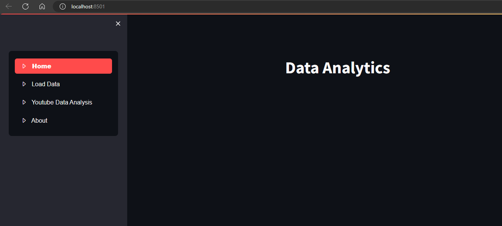
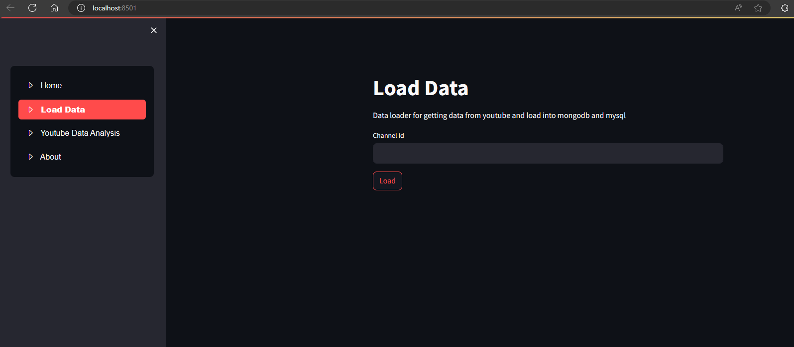
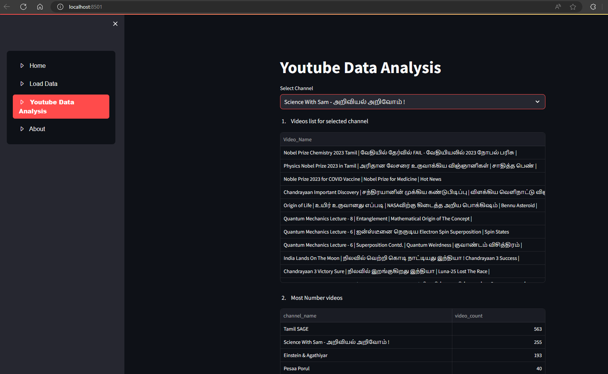

# Youtube data Analytics

This project is to load channel, video, playlist, comments into mongodb and mysql and do descriptive analytics and slicing and dicing of data.

To execute this project we can use data_viewer.py as below:

>$streamlit run data_viewer.py

## requirements.txt:

 - streamlit
 - pandas
 - mysql
 - pymongo
 - googleapiclient

## Screenshots

  

Loading channel information

  

Youtube Data Analysis

  

In to-be state these mongodb can be moved to cloud and load the data into snowflake datawarehouse by extending this project.

## About

Kannan Kandasamy

 - You can reach me at  kannanvijay@hotmail.com
 - Stackoverflow        https://stackoverflow.com/users/6466279/kannan-kandasamy
 - LinkedIn             https://www.linkedin.com/in/kannankandasamy/
